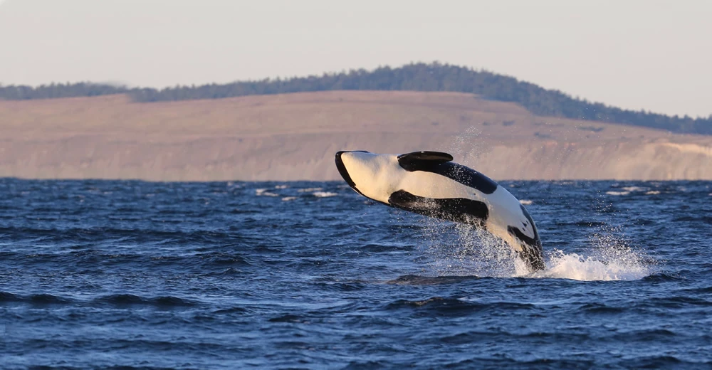

# Project-2
## Marine Mammal Sightings in the Pacific Northwest & Canada

## Table of Contents
* [Introduction](#introduction)
* [Technologies](#technologies)
* [Development Process](#development-process)
* [Data Sources](#data-sources)
* [Development Team](#development-team)

## Introduction
[Marine Mammal Visualization Project](https://marine-mammals.herokuapp.com/)

Our team project was to create a website to visualize marine mammal sightings. We predominantly focused on orcas, as all but 5 of our datapoints were orcas. We created a map for sightings utilizing different markers for different species, compared which pods were sighted together more often, and finally looked at the most active sighting locations and seasonal variations within those locations. 

## Technologies
1. Python
2. Beautiful Soup
3. Splinter
4. Selenium
5. Pandas
6. SQL
7. Sqlalchemy
    * Session
    * create_engine
    * inspect
    * func
    * Column, 
    * Float
    * Integer
    * String
    * Date
    * declarative_base
8. Flask 
    * render_template
    * jsonify
    * request
    * redirect
    * Flask_cors - CORS
9. Postgres
10. HTML & CSS
11. Bootstrap
12. Javscript
    * d3
    * popper
    * jquery
    * Leaflet
    * Plotly
    * amCharts 4
13. Mapbox
14. Heroku
15. Github

## Development Process

We utilized an API from the Whale Museum, which contained data in geoJSON format as well as city information, pod information, and day of sighting. We scraped the API, pulled it into PostgreSQL, used Sqlalchemy to connect to the database, and rendered our own API and routes using Flask. From here, we were able to build our website and create visualizations using Leaflet and Plotly. Finally, we utilized Heroku to deploy our website through Github. The following images are a few of the visualzations we created for our website:
1. [Pod Bar Chart](images/pod_bar.png)
This bar chart shows that J Pod is usually spotted within their own pod, whereas K and L are usually spotted with other pods.
2. [J Pod Pie](images/j_pod_pie.png)
Pie chart shows the percentages of times the J Pod is found alone versus with other pods. The website contains a dropdown menu to navigate between each pod. 
3. [Sightings Map](map_img.png)
This interactive map shows the many orca sightings within our dataset as well as 3 of the other 5 marine mammals sighted.
3. [Most Active Locations](active_locations.png)
This chart shows Friday Harbor is by far the location with the most sightings compared to the rest of the locations. 

## Data Sources

1. http://hotline.whalemuseum.org/api.json?limit=10000
2. https://www.whaleresearch.com/

# Development Team 
1. [Katy Luquire](https://github.com/CatherineLuquire)
2. [Bandana Deo](https://github.com/deobandana)
3. [Jonathan Brian Stoger](https://github.com/js04237)
4. [Seidi Mohammad](https://github.com/seidiali21)
